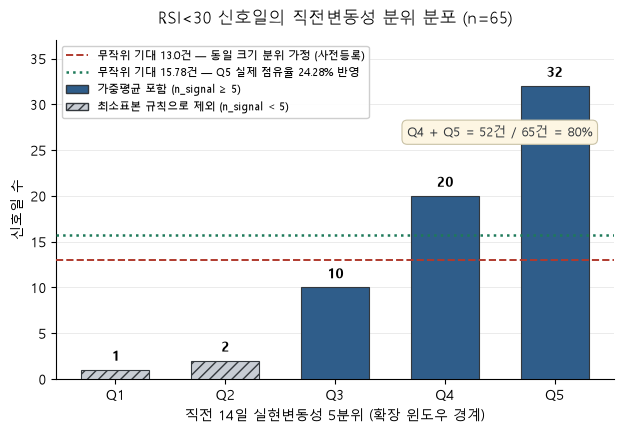

# 2주차 리포트 — 신호 명세부터 강건성 검증까지 (D5~D7)

**기간**: 2026-08-06 ~ 2026-08-08
**대상**: `^GSPC`, 분석 구간 2000-01-01 ~ 2026-07-31 (6,684거래일)
**상태**: 뼈대 — 수치 기입 완료, 해석 절은 사용자 작성 대기

> **이 문서의 작성 규칙.** 수치는 D5~D7 산출물에서 그대로 가져왔고 출처를 각
> 절에 명시했다. **판단·해석이 들어가는 절(§5, §6)은 비워두고 근거 수치만
> 나열했다.** 그 절들은 사용자가 직접 쓴다.

---

## 0. 논지 (백테스트 착수 전 고정, 2026-08-08)

> 26년 S&P 500에서 RSI·볼린저·MACD 기반 5개 신호를 사전등록 후 검정한 결과,
> 무작위 진입 대비 방향성 초과수익은 20개 조합 전부에서 관측되지 않았다.
> 원안에서 유일하게 유의했던 조합(S1, h=1)은 스튜던트화 순열검정에서
> 소멸했으며, 그 원인은 평균 차이가 아니라 신호일 집단의 분산 확대에
> 순열검정이 반보수적으로 반응한 것으로 규명되었다. 남은 관측은 신호가
> 방향이 아니라 변동성 국면을 식별한다는 것이며, 이것이 실질적 정보인지
> 기존 변동성 정보의 재표현인지는 **D8b 층화 반증 테스트**로 판별했다.

### 0-1. D8b 판별 결과 (2026-08-08 확정)

> RSI<30 신호일의 사후 20일 경로변동성은 비신호일 대비 1.81배이며,
> 직전 14일 실현변동성으로 5분위 층화한 뒤에도 가중평균 1.41배가 남아
> 사전등록 기준상 "잔여 정보 존재"로 판정된다. 다만 이 판정은 다음 세
> 가지 제약을 동반한다.
> (a) 신호 65건 중 52건이 상위 2개 분위에 집중되어 저변동 분위에서는
>     비교가 성립하지 않는다.
> (b) 가중평균은 Q5 32건에 지배되며, Q5 제외 시 1.2652로 판정 보류
>     구간에 들어간다.
> (c) 대조 변수가 직전 14일 실현변동성 단일 지표이므로, EWMA·GARCH 등
>     표준 변동성 모형 대비 우위는 검증되지 않았다.
> 따라서 본 결과는 결론이 아니라 D12 검증 후보로만 승격한다.
>
> 또한 본 결과는 수익률이 아니라 변동성에 관한 것이다. D7에서 확정된
> "20개 조합 전부에서 방향성 초과수익 없음"은 변경되지 않는다.

**앞 세 문장(§0 본문)은 D8b 결과와 무관하게 확정되어 있었다.** 사전등록
`docs/prereg_d08b_pathvol.md`(커밋 `f2f2947`)가 실행에 앞섰고, 결과는
`reports/day08b_pathvol.md`에 있다.

> **D8b와 D12는 다른 작업이다.** D8b는 **사후 경로변동성**을 종속변수로 두는
> 반증 테스트로 p값을 산출하지 않는다. D12는 **사후 수익률**을 종속변수로
> 두는 층화 **순열검정**이다. 상세 대비는 `prereg_d08_stratified.md` §1-1
> (해당 문서는 전제 오류로 폐기됐으나 D8/D12 대비표는 유효하다).

논지를 백테스트 **전에** 고정하는 이유는, 결과를 본 뒤 그에 맞는 서사를
만드는 것을 막기 위해서다. D8b 결과가 어느 쪽으로 나오든 앞 세 문장은
바뀌지 않으며, 바뀐다면 그것은 이 문단이 틀렸다는 뜻이지 서사를 고칠
근거가 아니다. **실제로 D8b는 예측(가중평균 1.1)을 크게 빗나간 1.4120이
나왔지만, 앞 세 문장은 그대로다.**

---

## 1. 연구 질문과 사전등록

**연구 질문:** RSI·볼린저밴드 신호는 무작위 진입보다 나은 수익을 내는가.
그리고 아니라면, 왜 아닌가.

### 1-1. 사전등록 구조 (`docs/signal_spec.md`)

D5에 분석 계획 전체를 **결과를 보기 전에** 확정했다. 핵심은 미결정 항목을
두 종류로 갈라 놓은 것이다 (§1.3).

| 구분 | 결과 보고 결정 | 항목 |
|---|---|---|
| **확증 검정 대상** ($m$에 들어감) | **금지** | 진입 임계값 30/70, 볼린저 $k=2$, 지평 $\{1,5,10,20\}$, 신호 목록 S1~S5 |
| **설계 파라미터** | **허용** (로그 기록 조건) | 청산 조건 X2, 시간 손절 $N$, 수수료율, 초기자본 |

### 1-2. 확정된 평가 프로토콜 (§6)

| 항목 | 값 |
|---|---|
| 사후 수익률 지평 | $h \in \{1, 5, 10, 20\}$ 거래일 |
| 진입 시점 | $t$일 종가 신호 확정 → $t+1$일 종가 진입 |
| 사후 수익률 | $r_{t,h} = C_{t+1+h} / C_{t+1} - 1$ |
| 최소 표본 수 | $n_{\min} = 30$ |
| 확증 검정 횟수 | $m = 5 \times 4 = 20$ |
| Bonferroni | $\alpha_{adj} = 0.05 / 20 = 0.0025$ |
| 순열검정 | $B = 10{,}000$, 시드 42, 양측, 검정통계량 **평균** |
| 귀무가설 | 신호일 평균 = **같은 기간 무작위 추출일** 평균 (0이 아님) |

### 1-3. 사전등록 검증 가능성

| 항목 | 커밋 |
|---|---|
| §7.1 예측 10칸 독립 재작성 (실측 열람 **전**) | `fce894c` |
| D6 사후 진단 사전 약속 (진단 실행 **전**) | `06be1c1` |
| D7 강건성 검증 사전 약속 (검증 실행 **전**) | `b076423` |

**커밋 시각 외에 "결과를 보기 전에 썼다"를 증명할 방법은 없다.**

---

## 2. 신호 5개와 실측 빈도

### 2-1. 명세 (§4.1)

| ID | 지표 | 평활 | 임계선 종류 | 가설 방향 | 성격 |
|---|---|---|---|---|---|
| S1 | RSI 14 < 30 | Wilder RMA, $\alpha=1/14$ | 무조건부 | 롱 | 평균회귀 |
| S2 | RSI 14 > 70 | Wilder RMA | 무조건부 | 숏 | 평균회귀 |
| S3 | 종가 < 볼린저 하단 | SMA 20, $k=2$, `ddof=0` | 조건부 | 롱 | 평균회귀 |
| S4 | 종가 > 볼린저 상단 | SMA 20, $k=2$, `ddof=0` | 조건부 | 숏 | 평균회귀 |
| S5 | MACD > Signal | EMA 12/26/9, `adjust=False` | 조건부 | 롱 | 모멘텀 |

**지표 이름만으로는 신호가 특정되지 않는다** (D3 O5: 동일한 "RSI 14"가 평활
방식에 따라 발동률 3.11배 차이). 그래서 평활 방식·시딩 관례·`ddof`·`adjust`까지
명세에 포함했다.

### 2-2. 실측 빈도와 예측 대비 (출처: `docs/signal_spec.md` 부록 C-1)

| 신호 | 레벨 발동률 | 실측 $n$ | 예측(본인) | 배율 | 예측(참고) | 배율 |
|---|---|---|---|---|---|---|
| S1 | 1.89% | 65 | 76 | 0.86 | 42 | 1.55 |
| S2 | 6.37% | 137 | 234 | 0.59 | 61 | 2.25 |
| S3 | 5.51% | 209 | 217 | 0.96 | 186 | 1.12 |
| S4 | 4.80% | 191 | 239 | 0.80 | 184 | 1.04 |
| S5 | 50.27% | 283 | 1,003 | 0.28 | 197 | 1.44 |

### 2-3. 오차 3분류 (출처: 부록 C-1)

원인을 가르는 결정적 수치는 **레벨 일수 실측/예측 비율**이다.

| 신호 | 레벨 비율 | 예측 $p$ | 실측 함의 $p$ | 분류 |
|---|---|---|---|---|
| S1 | 1.000 | 0.40 | 0.484 | 원인 1 (지속일수) |
| S2 | 1.000 | 0.45 | 0.678 | 원인 1 |
| S3 | 1.102 | 0.35 | 0.432 | 원인 2 + 1 |
| S4 | 0.872 | 0.35 | 0.405 | 원인 2 + 1 |
| S5 | 1.005 | 0.70 | 0.916 | 원인 1 |

- 예측한 $p$가 **5개 모두 실측보다 낮다** (+0.055 ~ +0.228)
- S3·S4의 상하 배분 예측(하단 5.0% / 상단 5.5%)이 실측(하단 5.51% / 상단 4.80%)과
  **방향이 반대**
- 원인 3 (엣지 변환 이해)은 해당 없음

---

## 3. 이벤트 스터디 결과

출처: `reports/day06_event_study.csv`

### 3-1. 전체 표본 기준선 (무작위 진입)

| $h$ | $n$ | 평균 | 표준편차 |
|---|---|---|---|
| 1 | 6,682 | +0.032% | 1.213% |
| 5 | 6,678 | +0.154% | 2.453% |
| 10 | 6,673 | +0.303% | 3.309% |
| 20 | 6,663 | +0.609% | **4.604%** |

§7.3의 20일 표준편차 가정은 5.4%였다. 실측 4.60%이므로 **가정이 17% 컸고**,
"필요 초과수익"은 그만큼 과대 추정이었다.

### 3-2. 신호별 초과수익 (무작위 진입 대비, %p)

| 신호 | h=1 | h=5 | h=10 | h=20 |
|---|---|---|---|---|
| S1 | **−0.502** | −0.198 | −0.026 | **+1.188** |
| S2 | −0.026 | −0.025 | +0.092 | +0.308 |
| S3 | −0.049 | +0.062 | −0.143 | +0.237 |
| S4 | −0.083 | −0.244 | −0.258 | −0.383 |
| S5 | −0.001 | −0.071 | −0.090 | −0.208 |

그림: `figures/day06_horizon_curves.png`, `figures/event_study_*.png` (5장)

### 3-3. 중첩 관측 진단 (출처: `reports/day06_overlap_diagnostic.csv`)

| 신호 | 간격 중앙값 | 중첩 심각 지평 |
|---|---|---|
| S1 | 32일 | 없음 |
| S2 | 9일 | h=10, h=20 |
| S3 | 18일 | h=20 |
| S4 | 21일 | 없음 |
| S5 | 21일 | 없음 |

---

## 4. 순열검정 20건

출처: `reports/day06_permutation.csv`, `reports/day07_studentized.csv`

### 4-1. 사전등록 통계량(평균) 결과

**20건 중 Bonferroni($\alpha_{adj} = 0.0025$) 통과 1건.**

| 신호 | 최소 $p$ (지평) | 통과 |
|---|---|---|
| S1 | **0.0019 (h=1)** | **1 / 4** |
| S2 | 0.4218 (h=20) | 0 / 4 |
| S3 | 0.4520 (h=20) | 0 / 4 |
| S4 | 0.1676 (h=5) | 0 / 4 |
| S5 | 0.4347 (h=20) | 0 / 4 |

§7.3의 사전 예측은 **0개**였다.

### 4-2. 통과 1건에 대한 사전등록 4항목 점검 (§7.3 반증 조건)

| # | 점검 | 결과 |
|---|---|---|
| 1 | `forward_returns()`가 $C_{t+1}$ 기준인가 | 정상 |
| 2 | `to_edge()`의 `shift(1)` 방향 | 정상 |
| 3 | 순열 모집단이 전체 거래일인가 | 정상 (h=1에서 6,682 / 6,684일) |
| 4 | 해당 조합의 중첩 진단 | 양호 (간격 중앙값 32거래일) |

### 4-3. 강건성 검증 결과 (D7, 탐색적)

**스튜던트화 통계량으로 바꾸면 통과가 1건 → 0건이 된다.**

| 신호 | h | sd_ratio | $p$ (평균) | $p$ (스튜던트화) |
|---|---|---|---|---|
| **S1** | **1** | **2.144** | **0.0019** | **0.1244** |
| S1 | 20 | 1.459 | 0.0360 | 0.1622 |
| S4 | 5 | 0.535 | 0.1676 | 0.0246 |

- 판정이 바뀐 조합: **1건 (S1 h=1)**
- 평균 통계량 통과 **1 / 20** → 스튜던트화 통과 **0 / 20**
- `sd_ratio > 1`인 조합은 $p$가 커지고, `sd_ratio < 1`인 조합은 작아진다

그림: `figures/day07_p_mean_vs_stud.png`, `figures/day07_signal_overview.png`

**방향 규칙의 이론 근거.** 이 방향성은 경험적 우연이 아니다. Behrens–Fisher
상황에서 **작은 집단의 분산이 더 크면 순열검정은 반보수적(과다기각)** 이고,
더 작으면 보수적이 된다. S1($n=65$, `sd_ratio` 2.14)은 전자라 스튜던트화 시
p가 상승하고, S4(`sd_ratio` 0.54~0.72)는 후자라 하락한다. **20/20 일치.**
인용: Chung & Romano (2013), *Annals of Statistics* 41(2), 484–507.

> **S4 다중검정 각주 — 후속 재검토를 막기 위해 지금 남긴다.**
>
> S4 h=5의 스튜던트화 $p = 0.0246$은 $\alpha_{adj} = 0.0025$를 넘지 못했으므로
> 판정은 **미기각**이다. 다만 20조합 중 유일하게 유의 방향으로 이동했으므로
> 재검토 유혹이 생길 수 있다.
>
> 검정이 서로 독립이라고 가정할 때, 20개 중 최소 p값이 0.0246 이하일 확률은
> $1 - (1 - 0.0246)^{20} \approx 0.39$이다. 검정 간 양의 상관을 고려하면 실제
> 확률은 이보다 낮다. 즉 **이 관측은 순수 잡음과 완전히 양립하며, 추가 탐색의
> 근거가 되지 않는다.** S4를 재검토하려면 D12 층화 순열 사전등록 문서에
> 명시적으로 등재한 뒤에만 수행한다.

---

## 5. 그 1건의 해체

> **TODO(사용자 작성)** — 아래 근거 수치를 바탕으로 해석을 작성한다.

**근거 수치:**

| 항목 | 값 | 출처 |
|---|---|---|
| 부호가 가설과 반대 | 초과수익 **−0.502%p** (S1은 롱·평균회귀 가설) | `day06_event_study.csv` |
| 사전 예측과의 관계 | §7.2에서 S1 h=1만 음수로 예측 (falling knife) | `signal_spec.md` §7.2 |
| `sd_ratio` | **2.144** — 20조합 중 **최고** | `day06_diag_variance.csv` |
| `t_naive` → `t_adj` | −3.34 → **−1.56** | 같은 파일 |
| **스튜던트화 $p$** | **0.1244** ($\alpha_{adj}$의 50배, $\alpha=0.05$도 초과) | `day07_studentized.csv` |
| 검정한 귀무 vs 묻고자 한 질문 | 평균 통계량 = **sharp null**(분포 동일)에 대한 정확검정. 관심 대상은 **weak null**(평균만 동일) | `day07_robustness.md` §9 |
| 효과 집중도 | 최악 3일이 초과수익 총합의 **80.8%** | `day07_robustness.md` §8 |
| 3일 제거 후 초과수익 | −0.502 → **−0.101%p** (5.0배 축소) | 같은 문서 |
| 방향성 일관성 | 표본 유의미한 4국면 중 **3국면**에서 신호일이 더 나쁨 | `day06_diag_regime.csv` |
| 국면 편중 (대안 2) | `rate_ratio` 최대 2.61 < 사전 기준 3 → **기각** | 같은 파일 |
| $B = 100{,}000$ 재실행 | $p$ 0.00190 → 0.00125, 95% 구간이 임계값 미포함 | `day06_diagnostics.md` §11 |

---

## 6. 대신 견고하게 확인된 것 — 익일 수익률 산포 2.14배

> **TODO(사용자 작성)** — 아래 근거 수치를 바탕으로 해석을 작성한다.

**근거 수치:**

| 항목 | 값 | 출처 |
|---|---|---|
| S1 h=1 `sd_ratio` | **2.144** (신호일 사후 변동성이 무조건부의 2.1배) | `day06_diag_variance.csv` |
| 3일 제거 후 `sd_ratio` | **1.4949** — 사전등록 기준 1.5 **미달** | `day07_robustness.md` §8 |
| 같은 조건에서 평균 축소 | **5.0배** | 같은 문서 |
| 사전 구간 $\tau$ = −5 → 0 | 가격이 **−5.3%** 하락한 뒤 발동 | `figures/day06_s1_pre_event.png` |
| D2 변동성 군집 | 6국면 전부 초과첨도 > 0 (1.24~5.82), 국면 간 연율변동성 3.30배 | `reports/day02_phase_stats.csv` |
| 분산비 VR(20) | **0.752** (< 1, 평균회귀 방향) — 부록 A 참조 | `day07_robustness.md` §8 |

**사전등록 판정:** 3일 제거 후 `sd_ratio` = 1.4949 < 1.5 → **강건성 기준 미달.**
분산비를 이상치에 강건한 발견으로 취급하지 **않는다.** 기준은 실행 전에 확정했고
실측이 그 아래이므로 미달이며, 차이의 크기는 판정과 무관하다.

**부가 관찰 (사전등록 아님):** 동일한 3일 제거 시 평균 차이는 5.0배, 분산비는
1.43배 축소됐다. 감쇠 배율의 이 비대칭은 기록하되 **판정을 대체하지 않는다.**

### 6-1. D8b 경로변동성 — `sd_ratio`와 다른 양이다

위 2.144는 **h=1 사후 수익률의 횡단면 산포**이지 실현변동성이 아니다. D8은
이 둘을 같다고 전제했다가 사전등록 전체를 폐기했다
(`docs/prereg_d08_stratified.md` 상단 폐기 블록). D8b는 **사건별 경로변동성**을
새로 정의해 측정했다.

| 항목 | D7 `sd_ratio` | D8b `ratio` |
|---|---|---|
| 사건당 값 | 수익률 1개 | 변동성 1개 (일별 로그수익률 20개의 sd) |
| 집계 | 65개 값의 **횡단면 표준편차** | 65개 값의 **평균** |
| 비교군 | 전체 거래일 (신호일 포함) | **비신호일만** |
| S1 실측 | 2.1437 (h=1) / 1.4588 (h=20) | **1.8091** ($R_0$) |

**D8b 결과** (출처: `reports/day08b_pathvol.md`)

| 항목 | 값 |
|---|---|
| 기준선 $R_0$ (층화 없음) | **1.8091** |
| 판별력 하한 | 1.15 → **판정 수행** |
| 판정 기준 ($R_0$ 확인 **전** 확정) | 없음 1.1780 / 존재 1.3560 |
| 층화 후 가중평균 (62건) | **1.4120** |
| **사전등록 판정** | **잔여 정보 존재** |
| 민감도: Q5 제외 (30건) | 1.2652 → 보류 구간 |
| 신호일 편중 | 65건 중 **52건(80.0%)** 이 Q4·Q5 |
| 층화 전 `prevol_gap_pct` | +42.25% |
| 층화 완전성 (`prevol_gap_pct` 기준) | 5분위 전부 양호 (최대 13.88%) |

**`prevol_gap_pct`가 잡지 못한 것:** 이 지표는 층 **내부**의 균질성만 잰다.
신호일이 층에 균등 분포하지 않으면 층 자체가 비교 단위로 기능하지 않는데,
다섯 분위 모두 "양호"를 받으면서 동시에 신호의 80%가 두 분위에 몰렸다.
**5분위로는 +42.25%의 사전 변동성 차이를 흡수하지 못했다.** → D12 재설계.

그림: `figures/day08b_signal_concentration.png`

---

## 7. 검정 설계의 한계

### 7-1. 교환가능성 (exchangeability)

표준 순열검정은 **날카로운 귀무가설**(라벨과 수익률이 완전 독립)을 검정하므로,
평균이 같아도 분산이 다르면 기각한다. 20조합 중 `sd_ratio` 판정:

| 판정 | 개수 |
|---|---|
| 양호 (< 1.2) | 12 |
| 주의 (1.2~1.5) | 3 |
| **액면 해석 불가 (> 1.5)** | **5** |

### 7-2. 중첩 관측

쿨다운을 두지 않았으므로 사후 수익률 구간이 겹칠 수 있다. S2가 h=10·h=20에서,
S3가 h=20에서 "중첩 심각"이다. 유효 표본이 명목 $n$보다 작아 p-value가 과소
추정될 수 있다. **측정하고 기록하는 것까지가 1단계 범위이며, 블록 부트스트랩은
적용하지 않았다.**

### 7-3. 몬테카를로 오차와 $B$ 재실행

$B = 10{,}000$에서 S1 h=1은 초과 관측 18건, $p = 0.0019$, MC 표준오차 0.00044,
95% 구간 [0.00105, 0.00275]로 **임계값을 포함**했다. $B = 100{,}000$에서
$p = 0.00125$, 구간 [0.00103, 0.00147]로 포함하지 않는다.

**$B$는 몬테카를로 오차만 줄이고 교환가능성 위반은 그대로 남는다.**
두 종류의 불확실성을 구분해야 한다.

### 7-4. 검정력

§7.3에서 **결과를 보기 전에** 계산한 통과 필요 초과수익:

| 신호 | 예측 $n$ | 필요 20일 초과수익 |
|---|---|---|
| S1 | 76 | 1.87%p |
| S2 | 234 | 1.07%p |
| S3 | 217 | 1.11%p |
| S4 | 239 | 1.05%p |
| S5 | 1,003 | 0.51%p |

실측 초과수익은 대부분 ±0.5%p 안이었다.

### 7-5. 기타 (출처: `signal_spec.md` §8.7)

- 지수 직접 매매 불가 (ETF 추적오차)
- 진입을 $t+1$ 종가로 잡아 신호 직후 하루 움직임을 놓침
- 2001년 호가 십진화·HFT 확산 등 시장 미시구조 변화
- parquet 스냅샷이 2026-07-31까지 (최신 4거래일 미포함)

---

## 8. D6~D7에서 틀린 것

### 8-1. §7.1 지속성 확률 $p$의 계통 과소평가

예측한 $p$가 **5개 모두** 실측보다 낮았다.

| 신호 | 예측 $p$ | 실측 $p$ | 차이 |
|---|---|---|---|
| S1 | 0.40 | 0.484 | +0.084 |
| S2 | 0.45 | 0.678 | +0.228 |
| S3 | 0.35 | 0.432 | +0.082 |
| S4 | 0.35 | 0.405 | +0.055 |
| S5 | 0.70 | 0.916 | +0.216 |

$1/(1-p)$는 $p \to 1$에서 급격히 커지므로, S5의 0.216 차이가 지속일수 3.3일 vs
11.87일이라는 **3.6배** 차이로 증폭됐다.

### 8-2. §6.6 중첩 경고의 오적중

사전 경고는 "**S5**가 h=10·h=20에서 중첩 심각"이었다. 그 경고는 S5 사건 수를
1,003건(평균 간격 7일)으로 예측한 데서 나왔다.

| | 예측 | 실측 |
|---|---|---|
| S5 사건 수 | 1,003 | 283 |
| S5 간격 | 7일 | 21일 |
| S5 중첩 심각 | h=10, h=20 | **없음** |
| 실제 중첩 심각 | — | **S2** (h=10, h=20), **S3** (h=20) |

**예측이 틀리면 그로부터 파생된 진단도 함께 틀린다.**

### 8-3. "3일이 86.1%"의 분모 미명시

D6 문서에 분모를 적지 않았다. 세 후보의 값이 전부 다르다.

| 분모 | 절대값 | 3일 비중 |
|---|---|---|
| 65개 원수익률 합 (D6에서 쓴 값) | −30.522%p | **86.1%** |
| 음수 관측 34개의 합 | −73.850%p | **35.6%** |
| **초과수익 총합 (65개 편차)** | **−32.632%p** | **80.8%** |

D6의 86.1%는 **원수익률 합**을 분모로 쓴 값이다. 양수와 음수가 상쇄된 합이라
분모로 삼기에 가장 약하다. **초과수익 총합(80.8%)이 관심 대상에 맞는 분모다.**

---

## 9. 3주차 계획과 이월 항목

### 9-1. 이월

| 항목 | 사유 | 이월처 |
|---|---|---|
| ~~층화 반증 테스트~~ (직전 14일 실현변동성 5분위 내 비교, 종속변수 = **사후 경로변동성**) | **D8b에서 완료** — $R_0$ 1.8091, 가중평균 1.4120, "잔여 정보 존재" | — |
| **층화 순열검정** (국면 내 또는 실현변동성 10분위 내 재표집, 종속변수 = **사후 수익률**) | 교환가능성 위반의 정공법이나 **새로운 검정이라 $m$ 문제** | **D12** |
| **층화 재설계** (신호일 분포 기준 층 설계 + EWMA/GARCH 대조군 추가) | D8b에서 5분위가 사전 변동성 차이 **+42.25%** 를 흡수하지 못했고, 신호 **80%** 가 상위 2분위에 몰렸다 | **D12** |
| 극단값 민감도 체계화 | 3일 제거 대비를 사후 수익률 분포 전체로 확장 | D12 |
| ~~이분산 강건 VR(20)~~ | **D7에서 처리됨** — Lo–MacKinlay $\hat\theta^*$ 적용, 부록 A | — |
| 진입 지연 ($t+2$) 실험 | **진입 시점은 확증 대상에 가까워 변경 시 $m$ 재계산 필요** | D14 가설 목록 |
| 신호 조합 실험 | family를 흔들지 않기 위해 D7 계획에서 제외 | 미정 |

### 9-2. 3주차 주요 일정

| 일자 | 작업 |
|---|---|
| ~~D8~~ | **완료** — 층화 반증 테스트(변동성), `reports/day08b_pathvol.md` |
| D10 | `src/backtest.py` — 포지션 상태 기계, X1 ∨ X2-c 청산 |
| D11 | 무위험수익률 시계열 확정 (FRED `DGS3MO` 또는 `^IRX`) |
| D12 | 국면별 성과 매트릭스 + 층화 **순열검정** (수익률) |
| D13 | 파라미터 히트맵 (**최적값 채택 금지**, 고원/봉우리 판별용) |
| D14 | `reports/why_it_fails.md` |
| D16 | 2단계 프레임워크 대조 |

### 9-3. `why_it_fails.md` 후보 목록 (D14)

- 금융위기 355거래일 중 RSI > 70 발동 **0일** → 청산 신호의 이항적 소멸
- 검정력 부족 — S1 $n = 65$로 탐지 가능한 효과 크기가 아니었음
- 교환가능성 위반 — `sd_ratio > 1.5`인 5조합
- 예측의 계통 오차 — 지속성 과소평가, 파생 진단의 연쇄 오류
- (a)/(b)/(c) 분류 틀의 판별력 — D3 RSI 시드 = (b), D4 ATR 잔차 = (c)

---

## 부록 A. 분산비 VR(20) — 지수 자체의 성질

**본 분석의 논리 흐름과 분리해 부록에 둔다.** 이 지표는 신호의 성질이 아니라
`^GSPC` 지수 자체의 성질이며, 신호와 무관하므로 $m = 20$ 검정 family와도 무관하다.
다중검정 문제가 없다.

$$
VR(20) = \frac{\mathrm{Var}(20\text{일 로그수익률})}{20 \times \mathrm{Var}(1\text{일 로그수익률})}
$$

| 항목 | 값 |
|---|---|
| **VR(20)** | **0.7518** |
| 일간 관측 | 6,683 |
| 중첩 보정 후 유효 표본 | 약 334 |
| $\hat\theta^*$ (Lo–MacKinlay 이분산 강건) | 118.15 |
| SE\* (강건) | 0.1330 |
| **$z^*$ (강건)** | **−1.87** |

$VR < 1$은 20일 지평에서 평균회귀(음의 자기상관) 방향을 시사한다.

**등분산 iid 가정 하의 $z = -4.08$은 제거했다.** 팻테일·이분산 자료에서 해석할 수
없는 값이기 때문이다. 점추정치는 그대로이고 **분모만 Lo–MacKinlay 이분산 강건
추정량으로 교체**했다. 등분산 이론값 $\hat\theta^* = 24.70$ 대비 실측 118.15로
**SE가 2.19배 팽창**하며, $z$가 −4.08에서 −1.87로 줄어든다.
$|z^*| = 1.87$은 양측 $p \approx 0.06$ 수준이다.

> **$z^*$도 유의성 주장에 쓰지 않는다.** 이분산은 보정했으나 **중첩 창 문제가
> 남아 있다** — 유효 표본이 334인데 $\hat\theta^*$는 명목 $T = 6{,}683$을 쓴다.
> **방향 참고용이다.**

**구현 검산:** iid 시뮬레이션 20만 관측에서 $\hat\theta^* = 24.66$으로 등분산
이론값 24.70의 0.998배였다. 구현이 등분산 케이스로 올바르게 수렴한다.
